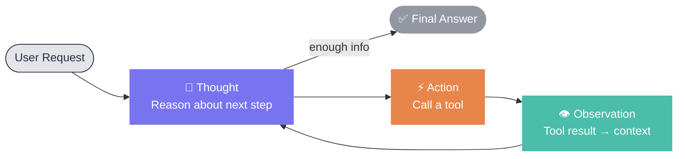

# The ReAct loop

::subtitle::

The dominant pattern for tool-calling agents

---

# ReAct: Reason + Act

The dominant pattern for tool-calling agents (Yao et al., 2022)

  

    
🤔

    
Thought

    
LLM reasons about what to do next

  

  

    
⚡

    
Action

    
Calls a tool with specific arguments

  

  

    
👁

    
Observation

    
Tool result fed back into context

  

  

    
🔁

    
Repeat

    
Until the LLM has enough to answer

  

<v-click>

The loop runs <strong style="color: #7874F0;">inside a single user request</strong>. Each iteration is a separate LLM call — invisible without tracing.

</v-click>

<!--
ReAct is the reasoning pattern behind most tool-calling agents today. The model alternates between thinking and acting. Without tracing, every iteration is invisible.
-->

---

# ReAct: The Loop

Each iteration is a separate LLM call — <strong style="color: #7874F0;">invisible without tracing</strong>.

<!--
The diagram makes the loop explicit: Thought drives Action, Action returns an Observation, which feeds the next Thought. The cycle exits only when the model decides it has enough to answer.
-->
