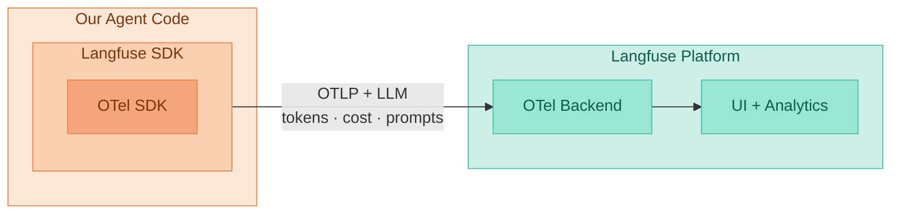

# Langfuse

::subtitle::

Open-source LLM observability built on OpenTelemetry

---

# Langfuse

Open-source LLM observability platform

<v-clicks>

- **Built on OpenTelemetry** — a native OTel backend that extends it with LLM-specific data: tokens, cost, prompts, and generations
- **Traces** every LLM call, tool call, and step — with full inputs/outputs
- **Open-source** (MIT) and self-hostable via Docker Compose, or use Langfuse Cloud
- **SDKs** for Python, TypeScript, and any OpenAI-compatible API
- **Drop-in OpenAI wrapper** — one import change, no refactor
- **Evaluations** — score traces programmatically or via human review

</v-clicks>

<!--
Open source, MIT license. Self-host from day one — no production data leaves your infra.
-->

---

# Langfuse & OpenTelemetry

<!--
Langfuse SDK wraps OTel SDK — it speaks standard OTLP but enriches every span with LLM-specific attributes (tokens, cost, prompt/completion text). The backend is a native OTel collector, so any plain OTel SDK can also ship traces to it.
-->

---

# Langfuse data model

Traceone user request, end-to-end

Span: agentthe ReAct loop

Span: LLM callThought 1 — decides to search

Span: tool / searchAction 1 + Observation 1

Span: LLM callThought 2 — decides to calculate

Span: tool / calculateAction 2 + Observation 2

Span: LLM callFinal answer

<v-click>

  Each span captures: <strong>input · output · latency · tokens · cost · metadata</strong>

</v-click>

<!--
A trace is one request from end to end. Spans are the steps inside it — one per ReAct iteration. This nesting is what lets you see exactly where time and tokens went.
-->
