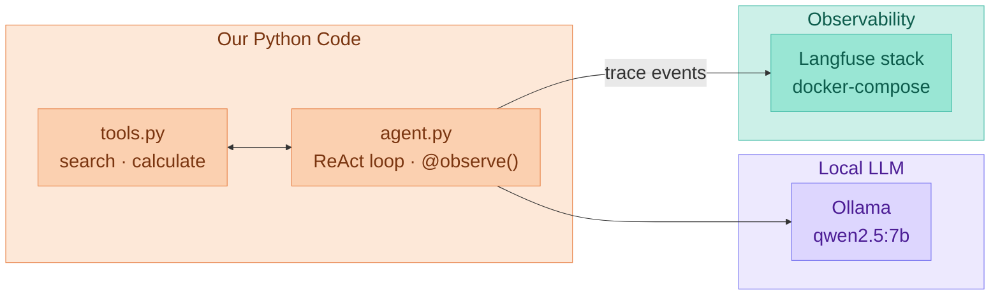

# Demo architecture

::subtitle::

How the pieces fit together before we touch any code

---

# Architecture

<!--
agent.py talks to an OpenAI-compatible endpoint served by Ollama. The only instrumentation is swapping the OpenAI import for langfuse.openai and adding @observe(): every chat completion and tool call is now also shipped to the Langfuse stack, which docker-compose brings up as one unit (web, worker, Postgres, ClickHouse, Redis, MinIO).
-->
