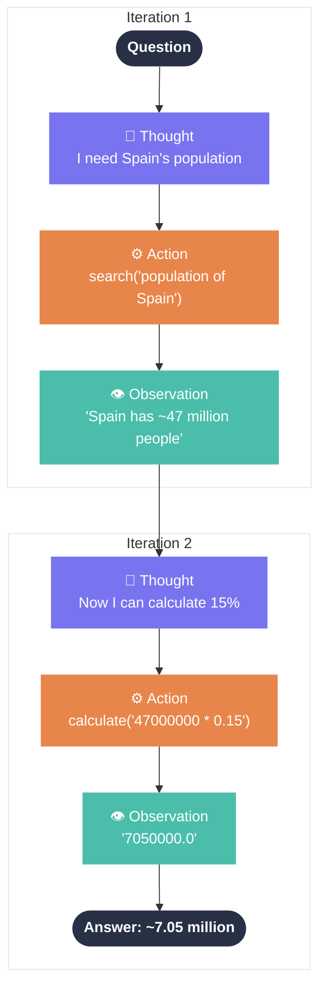

# Our agent, adapted to the ReAct loop

::subtitle::

<p class="section-sub">From the abstract pattern to actual code</p>

---

# Our demo agent

<p style="color: #7874F0; font-weight: 600; margin-bottom: 1rem;">"What is 15% of the population of Spain?"</p>

<div style="transform: scale(0.75); transform-origin: top center; margin-bottom: -8rem;">



</div>

<!--
This is the exact trace we'll see in Langfuse. Two iterations of the ReAct loop: one search, one calculation, then a final answer.
-->

---

# What to observe at each step

<div style="display: grid; grid-template-columns: repeat(3, 1fr); gap: 1rem; margin-top: 0.75rem;">
  <div style="background: rgba(40,48,70,0.06); border-radius: 12px; padding: 1.2rem;">
    <div style="font-weight: 700; color: #7874F0; margin-bottom: 0.75rem;">LLM Call</div>
    <ul style="list-style: none; padding: 0; margin: 0; font-size: 0.88rem;">
      <li style="padding: 0.25rem 0;">Prompt (system + user)</li>
      <li style="padding: 0.25rem 0;">Model + parameters</li>
      <li style="padding: 0.25rem 0;">Completion text</li>
      <li style="padding: 0.25rem 0;">Token usage + cost</li>
      <li style="padding: 0.25rem 0;">Latency</li>
    </ul>
  </div>
  <div style="background: rgba(40,48,70,0.06); border-radius: 12px; padding: 1.2rem;">
    <div style="font-weight: 700; color: #E8854A; margin-bottom: 0.75rem;">Tool Call</div>
    <ul style="list-style: none; padding: 0; margin: 0; font-size: 0.88rem;">
      <li style="padding: 0.25rem 0;">Tool name</li>
      <li style="padding: 0.25rem 0;">Input arguments</li>
      <li style="padding: 0.25rem 0;">Output / result</li>
      <li style="padding: 0.25rem 0;">Duration</li>
      <li style="padding: 0.25rem 0;">Errors</li>
    </ul>
  </div>
  <div style="background: rgba(40,48,70,0.06); border-radius: 12px; padding: 1.2rem;">
    <div style="font-weight: 700; color: #4ABEAA; margin-bottom: 0.75rem;">Full Trace</div>
    <ul style="list-style: none; padding: 0; margin: 0; font-size: 0.88rem;">
      <li style="padding: 0.25rem 0;">End-to-end latency</li>
      <li style="padding: 0.25rem 0;">Total token cost</li>
      <li style="padding: 0.25rem 0;">Number of iterations</li>
      <li style="padding: 0.25rem 0;">User / session ID</li>
      <li style="padding: 0.25rem 0;">Success / failure</li>
    </ul>
  </div>
</div>

---

# The agent

<div style="transform: scale(0.8); transform-origin: top left; width: 125%;">

```python
# demo/agent.py
import json, os
from openai import OpenAI
from tools import TOOLS, search, calculate

client = OpenAI(base_url=os.getenv("OPENAI_BASE_URL", "http://localhost:11434/v1"),
                api_key=os.getenv("OPENAI_API_KEY", "ollama"))
MODEL = os.getenv("MODEL", "qwen2.5:7b")
TOOL_MAP = {"search": search, "calculate": calculate}

def run_agent(question: str) -> str:
    messages = [{"role": "user", "content": question}]
    while True:
        response = client.chat.completions.create(model=MODEL, messages=messages, tools=TOOLS)
        msg = response.choices[0].message
        if msg.tool_calls:
            messages.append(msg)
            for tc in msg.tool_calls:
                fn_name = tc.function.name
                fn_args = json.loads(tc.function.arguments)
                result = TOOL_MAP[fn_name](**fn_args)
                messages.append({"role": "tool", "tool_call_id": tc.id, "content": result})
        else:
            return msg.content
```

</div>

<!--
Standard OpenAI SDK pointed at Ollama. Complete, working — but a black box. This is the "before" — we instrument it next.
-->

---

# Adding Langfuse — 1 import swap

<div style="transform: scale(0.78); transform-origin: top left; width: 128%;">

````md magic-move {lines: true}
```python {3}
# demo/agent.py
import json, os
from openai import OpenAI
from tools import TOOLS, search, calculate

client = OpenAI(base_url=os.getenv("OPENAI_BASE_URL", "http://localhost:11434/v1"),
                api_key=os.getenv("OPENAI_API_KEY", "ollama"))
MODEL = os.getenv("MODEL", "qwen2.5:7b")
TOOL_MAP = {"search": search, "calculate": calculate}

def run_agent(question: str) -> str:
    messages = [{"role": "user", "content": question}]
    while True:
        response = client.chat.completions.create(model=MODEL, messages=messages, tools=TOOLS)
        msg = response.choices[0].message
        if msg.tool_calls:
            messages.append(msg)
            for tc in msg.tool_calls:
                fn_name = tc.function.name
                fn_args = json.loads(tc.function.arguments)
                result = TOOL_MAP[fn_name](**fn_args)
                messages.append({"role": "tool", "tool_call_id": tc.id, "content": result})
        else:
            return msg.content
```

```python {3-4,11,13|all}
# demo/agent_traced.py
import json, os
from langfuse.openai import OpenAI           # ← only change for LLM tracing
from langfuse.decorators import observe      # ← nest all steps under one trace
from tools import TOOLS, search, calculate

client = OpenAI(base_url=os.getenv("OPENAI_BASE_URL", "http://localhost:11434/v1"),
                api_key=os.getenv("OPENAI_API_KEY", "ollama"))
MODEL = os.getenv("MODEL", "qwen2.5:7b")
TOOL_MAP = {"search": search, "calculate": calculate}

@observe()
def run_agent(question: str) -> str:
    messages = [{"role": "user", "content": question}]
    while True:
        response = client.chat.completions.create(model=MODEL, messages=messages, tools=TOOLS)
        msg = response.choices[0].message
        if msg.tool_calls:
            messages.append(msg)
            for tc in msg.tool_calls:
                fn_name = tc.function.name
                fn_args = json.loads(tc.function.arguments)
                result = TOOL_MAP[fn_name](**fn_args)
                messages.append({"role": "tool", "tool_call_id": tc.id, "content": result})
        else:
            return msg.content
```
````

</div>

<!--
Line 3: swap `openai` for `langfuse.openai` — every chat.completions.create() is now traced automatically.
Line 4 + @observe(): wraps the whole agent in a parent span so all steps nest under one trace.
The rest of the code is identical.
-->
